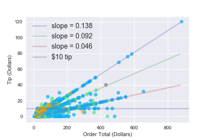

# Delivery

Using a sample DoorDash dataset, I analyze several patterns in the data, specifically focusing on several findings that could be potentially interesting for the delivery company. This includes insights on UX design and customer spending trends.

### Data Sources:
* https://github.com/ralfsantacruz/Doordash-Analytics/tree/master/resources
* https://www.kaggle.com/code/alrafikri/food-delivery-data-analytics

### Summary of findings:

#### Order Cost vs Amount Tipped:

Under $200 there are widely varying tip amounts, but a good amount of the tips lie on the 5%, 10% and 15% trendlines. This either corresponds to the three tip options on DoorDash that are automatically fed to the customer or that customers are willing to go out of their way to calculate these values specifically (I suspect the former).

There is an odd spike in requested refund amount after waiting an hour and a half for delivery (this could be an indication of a general acceptable delivery time limit before customers try to refund their entire order, or that restaurants cancel orders that could not be fulfilled).

Very common discount amounts seem to be the entire order as well as the two common discount amounts offered by special DoorDash deals on the website.

### Preparing the Data