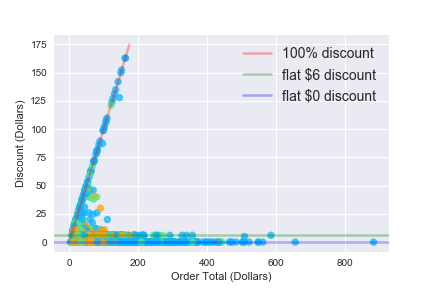
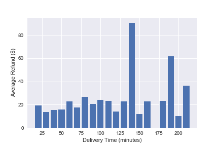

# Delivery

The goal of this project was just an explorative data analysis of a DoorDash dataset. I specifically focused on several findings that could be potentially interesting to the delivery company itself. This includes potential insights on UX design and customer spending trends.

### Data Sources:
* https://github.com/ralfsantacruz/Doordash-Analytics/tree/master/resources
* https://www.kaggle.com/code/alrafikri/food-delivery-data-analytics

### Summary of findings:

#### Order Cost vs Amount Tipped:

Under $200 there are widely varying tip amounts, but a good amount of the tips lie on the 5%, 10% and 15% trendlines. This either corresponds to the three tip options on DoorDash that are automatically fed to the customer or that customers are willing to go out of their way to calculate these values specifically (I suspect the former). Customers also seem to favor flat tip amounts (could also be because DoorDash often suggests flat tip amounts).

#### Order Cost vs Discounted Amount:

Many restaurants on DoorDash do offer discount options of "X% off, up to $5 or $6", and it seems that many customers take advantage of this. Note that since it is "up to $5 or $6", many orders not on the trend lines could also be taking advantage of the offered deals. Another common discount amount, as well as being the upper limit, is the entire order cost.

#### Average Refund vs Delivery Time:

There is an odd spike in requested refund amount after waiting an hour and a half for delivery (this could be indicative of a general acceptable delivery time limit before customers try to cancel their entire order, or a response time in restaurants cancelling orders that could not be fulfilled [i.e. the restaurant wasn't opened that day but orders were still being requested]).